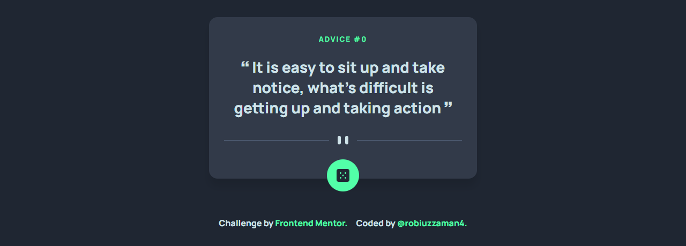

# Frontend Mentor - Advice generator app solution

This is a solution to the [Advice generator app challenge on Frontend Mentor](https://www.frontendmentor.io/challenges/advice-generator-app-QdUG-13db). Frontend Mentor challenges help you improve your coding skills by building realistic projects.

## Table of contents

- [Overview](#overview)
- [The challenge](#the-challenge)
- [Screenshot](#screenshot)
- [Links](#links)
- [Built with](#built-with)
- [Author](#author)

## Overview

### The challenge

Users should be able to:

- View the optimal layout for the app depending on their device's  screen size
- See hover states for all interactive elements on the page
- Generate a new piece of advice by clicking the dice icon

### Screenshot

### Links

- Solution URL: [https://www.frontendmentor.io/challenges/advice-generator-app-QdUG-13db/solutions/new](https://www.frontendmentor.io/challenges/advice-generator-app-QdUG-13db/solutions/new)
- Live Site URL: [(https://robiuzzaman4.github.io/advice-generator-app/](https://robiuzzaman4.github.io/advice-generator-app/)

### Built with

- Semantic HTML5 Markup
- CSS Custom Properties
- CSS Flexbox
- Vanila JavaScript
- Advice Slip Api
- Mobile-first Workflow

## Author

- Website - [robiuzzaman](https://minifolio-portfolio.netlify.app/)
- Frontend Mentor - [@robiuzzaman4](https://www.frontendmentor.io/profile/@robiuzzaman4)
- Twitter - [@robuizzaman4](https://twitter.com/robiuzzaman4)